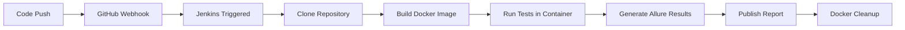

# 🧪 Playwright CI/CD Automation with Jenkins, Docker & Allure

[](https://playwright.dev/)
[](https://www.jenkins.io/)
[](https://www.docker.com/)
[](https://aws.amazon.com/)

---

This project implements a **real-world CI/CD pipeline** for running Playwright UI automation tests using Jenkins, Docker, and Allure reports on AWS EC2. The pipeline automatically runs tests on every push to the main branch and publishes reports reliably.

[Check Now!](https://www.linkedin.com/posts/sumit-kushwaha-4a1344254_automation-playwright-cicd-activity-7413326250133581824-biMm?utm_source=share&utm_medium=member_desktop&rcm=ACoAAD6yxbkBacsZo7lxj1ccsSgJrMLVTmqpaK8)

---

## 🎯 Project Goal

- ✅ Automatically run UI tests on every code push
- ✅ Use Docker for clean, isolated test execution
- ✅ Generate reports even when tests fail
- ✅ Avoid Jenkins / EC2 disk space issues
- ✅ Follow production-grade CI/CD practices

---

## 🧰 Tech Stack

| Technology | Purpose |
|------------|---------|
| **Playwright** | UI Automation |
| **Jenkins** | CI/CD Orchestration |
| **Docker** | Containerized Execution |
| **Allure** | Test Reporting |
| **AWS EC2 + EBS** | Infrastructure |
| **GitHub** | Version Control |

---

## 🔄 CI/CD Flow (High Level)



1. Code pushed to `main` branch
2. GitHub webhook triggers Jenkins
3. Jenkins clones repository
4. Docker image is built
5. Tests run inside Docker container
6. Allure results are generated
7. Allure report is published
8. Docker cleanup runs to save disk space

---

## 🔌 Jenkins Plugins Required

Install from **Manage Jenkins → Plugins**:

- ✅ Git Plugin
- ✅ Pipeline Plugin
- ✅ Docker Pipeline Plugin
- ✅ Allure Jenkins Plugin

---

## 🔐 Credentials & Environment Management

All sensitive values are stored in **Jenkins Credentials**, not in code.

**Examples:**
- Application URLs
- Login usernames
- Passwords / tokens

Injected into Docker using environment variables.

✅ **Secure**  
❌ **No hardcoded secrets**

---

## 🐳 Docker Setup for Jenkins

### Problem
Jenkins cannot run Docker commands by default.

### Fix
Give Docker permission to Jenkins user:

```bash
sudo usermod -aG docker jenkins
sudo systemctl restart jenkins
```

### Verify:
```bash
docker ps
```

---

## 💾 Disk Space Problem

### Issue Faced
- Jenkins built-in node uses limited root storage
- Docker images + reports quickly fill disk
- Pipelines start failing with space errors

### Solution Used
1. Attach **EBS volume** to EC2
2. Use it for Jenkins workspace
3. Clean Docker after every pipeline run

```groovy
post {
  always {
    sh 'docker system prune -af || true'
  }
}
```

This keeps Jenkins stable long-term.

---

## 🧪 Test Execution Strategy

- ✅ Tests run inside Docker
- ✅ Container removed after execution (`--rm`)
- ✅ No leftover state between builds
- ✅ Same environment every run

---

## 📊 Reporting Strategy

### Playwright Report
- Generated after each test run
- Helpful for debugging failures

### Allure Report
- Generated **even if tests fail**
- Must be published in `post { always {} }`

```groovy
post {
  always {
    allure(results: [[path: 'allure-results']])
  }
}
```

---

## 🚫 Allure Permission Error

### Error
```
AccessDeniedException: allure-results/testrun.json
```

### Root Cause
Docker creates files as root, Jenkins cannot write to them.

### Fix
```bash
sudo chown -R jenkins:jenkins /var/lib/jenkins/workspace
sudo chmod -R 755 /var/lib/jenkins/workspace
```

---

## 🖼 Playwright Snapshot Issue

### Problem
Snapshots created locally on Windows/Mac:
```
*-chromium-win32.png
```

CI runs on Linux:
```
*-chromium-linux.png
```

Playwright treats them as different → tests fail every time.

### Correct Fix (Industry Standard)

1. Generate snapshots on Linux:

2. Commit Linux snapshots only:
```
*-chromium-linux.png
```

---

## 🚀 CI Triggering

### Recommended Way
- **GitHub Webhook**
  - Instant trigger on push
  - Industry standard

### Alternative
- SCM polling (not recommended for production)

---

## 🧠 Challenges Faced (Interview Gold)

| Challenge | Resolution |
|-----------|------------|
| Docker permission issues in Jenkins | Added jenkins user to docker group |
| EC2 disk getting full | Attached EBS volume + Docker cleanup |
| Allure report not generating on failure | Used `post { always {} }` block |
| Snapshot mismatch across OS | Generated Linux snapshots only |
| Jenkins workspace permission errors | Fixed ownership and permissions |

---

## ✅ Project Status

- ✔ Fully automated CI
- ✔ Stable Docker execution
- ✔ Reliable Allure reporting
- ✔ Production-ready setup

---

## 📣 Usage

This project reflects real QA / SDET CI pipelines used in companies and is suitable for:

- 🎯 QA Automation roles
- 🎯 SDET interviews
- 🎯 DevOps + QA hybrid roles

---

⭐ **Star this repo if you find it helpful!**
